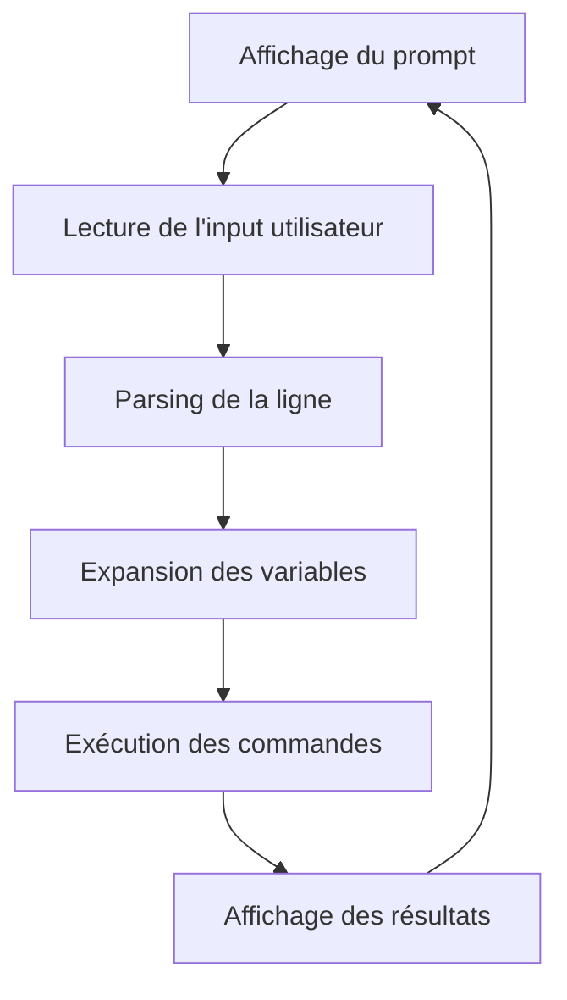

# 📚 Cours Complet : Création d'un Minishell de A à Z

## 📋 Table des Matières
1. [Introduction et Concepts Théoriques](#introduction)
2. [Architecture et Structure du Projet](#architecture)
3. [Les Structures de Données](#structures)
4. [Parsing et Tokenisation](#parsing)
5. [Expansion de Variables](#expansion)
6. [Gestion des Signaux](#signaux)
7. [Exécution des Commandes](#execution)
8. [Commandes Built-in](#builtins)
9. [Pipes et Redirections](#pipes)
10. [Gestion Mémoire et Cleanup](#memoire)
11. [Compilation et Makefile](#compilation)
12. [Tests et Débogage](#tests)

---

## 1. Introduction et Concepts Théoriques {#introduction}

### 🎯 Qu'est-ce qu'un Shell ?

> **📖 Théorie**
>
> Un shell est un **interpréteur de commandes** qui fait l'interface entre l'utilisateur et le système d'exploitation. Il :
> - Lit les commandes tapées par l'utilisateur
> - Les analyse (parsing)
> - Les exécute
> - Affiche les résultats

### 🔄 Le Cycle de Vie d'un Shell



### 📚 Concepts Clés à Maîtriser

> **⚠️ Important**
>
> Avant de commencer, vous devez comprendre :
> - **Processus** et **fork()**
> - **Pipes** et **redirections**
> - **Variables d'environnement**
> - **Signaux Unix**
> - **Parsing de chaînes**

---

## 🔄 Les Processus Unix - Fondamentaux Essentiels

### 🎯 Qu'est-ce qu'un Processus ?

> **📖 Théorie**
>
> Un **processus** est un programme en cours d'exécution avec :
> - **PID** : identifiant unique du processus
> - **Mémoire virtuelle** : espace mémoire isolé
> - **Descripteurs de fichiers** : accès aux fichiers/périphériques
> - **Variables d'environnement** : configuration héritée
> - **Répertoire de travail** : position dans le système de fichiers

### 🌳 Hiérarchie et Relations

```
init/systemd (PID 1)
├── login shell (bash/zsh)
│   ├── minishell (notre programme)
│   │   ├── ls (commande enfant)
│   │   ├── grep (pipe suivant)
│   │   └── cat (redirection)
│   └── autres processus...
└── services système...
```

### 🔧 Les Appels Système Fondamentaux

#### 1. `fork()` - Créer un Processus

```c
#include <unistd.h>
#include <sys/wait.h>

int main(void)
{
    pid_t pid;

    printf("Avant fork() - PID: %d\n", getpid());

    pid = fork();

    if (pid == 0)
    {
        // Code du processus ENFANT
        printf("Enfant - PID: %d, Parent: %d\n", getpid(), getppid());
        sleep(1);
        exit(42);  // Code de retour
    }
    else if (pid > 0)
    {
        // Code du processus PARENT
        int status;
        printf("Parent - PID: %d, Enfant: %d\n", getpid(), pid);

        // Attendre l'enfant
        waitpid(pid, &status, 0);
        printf("Enfant terminé avec code: %d\n", WEXITSTATUS(status));
    }
    else
    {
        // Erreur fork()
        perror("fork failed");
        return 1;
    }

    return 0;
}
```

**🔍 Points clés :**
- Après `fork()`, il y a **2 processus** identiques
- Le parent reçoit le PID de l'enfant
- L'enfant reçoit 0
- En cas d'erreur, `fork()` retourne -1

#### 2. Famille `exec()` - Remplacer un Programme

```c
// Les différentes variantes d'exec
int execl(const char *path, const char *arg, ...);
int execlp(const char *file, const char *arg, ...);
int execle(const char *path, const char *arg, ..., char *const envp[]);
int execv(const char *path, char *const argv[]);
int execvp(const char *file, char *const argv[]);
int execve(const char *path, char *const argv[], char *const envp[]);

// Exemple pratique
void execute_command(char *program, char **args)
{
    pid_t pid = fork();

    if (pid == 0)
    {
        // Dans l'enfant : remplacer par le nouveau programme
        execvp(program, args);

        // Si on arrive ici, exec a échoué
        perror("execvp failed");
        exit(127);  // Code d'erreur standard
    }
    else if (pid > 0)
    {
        // Parent : attendre la fin
        int status;
        waitpid(pid, &status, 0);
        return WEXITSTATUS(status);
    }
    else
    {
        perror("fork failed");
    }
}
```

#### 3. `wait()` et `waitpid()` - Synchronisation

```c
#include <sys/wait.h>

// Attendre N'IMPORTE QUEL enfant
pid_t wait(int *status);

// Attendre un enfant SPÉCIFIQUE
pid_t waitpid(pid_t pid, int *status, int options);

// Exemple d'utilisation
void example_wait(void)
{
    int status;
    pid_t child_pid;

    child_pid = waitpid(-1, &status, 0);  // -1 = n'importe quel enfant

    if (WIFEXITED(status))
        printf("Processus %d terminé avec code %d\n",
               child_pid, WEXITSTATUS(status));
    else if (WIFSIGNALED(status))
        printf("Processus %d tué par signal %d\n",
               child_pid, WTERMSIG(status));
}
```

### 🔗 Communication Inter-Processus

#### Pipes Anonymes

```c
#include <unistd.h>

int create_pipe_communication(void)
{
    int pipe_fd[2];
    pid_t pid;
    char buffer[256];

    // Créer le pipe
    if (pipe(pipe_fd) == -1)
    {
        perror("pipe");
        return -1;
    }

    pid = fork();

    if (pid == 0)
    {
        // ENFANT : écrivain
        close(pipe_fd[0]);  // Fermer lecture

        write(pipe_fd[1], "Hello from child!", 17);
        close(pipe_fd[1]);
        exit(0);
    }
    else if (pid > 0)
    {
        // PARENT : lecteur
        close(pipe_fd[1]);  // Fermer écriture

        ssize_t bytes = read(pipe_fd[0], buffer, sizeof(buffer) - 1);
        buffer[bytes] = '\0';

        printf("Parent reçu: %s\n", buffer);
        close(pipe_fd[0]);

        wait(NULL);
    }

    return 0;
}
```

#### Pipeline Complexe

```c
// Exemple : echo "hello" | grep "ell" | wc -c
void create_pipeline(void)
{
    int pipe1[2], pipe2[2];
    pid_t pid1, pid2, pid3;

    // Créer les pipes
    pipe(pipe1);
    pipe(pipe2);

    // Premier processus : echo
    if ((pid1 = fork()) == 0)
    {
        dup2(pipe1[1], 1);  // stdout -> pipe1 écriture
        close(pipe1[0]);
        close(pipe1[1]);
        close(pipe2[0]);
        close(pipe2[1]);

        execlp("echo", "echo", "hello", NULL);
    }

    // Deuxième processus : grep
    if ((pid2 = fork()) == 0)
    {
        dup2(pipe1[0], 0);  // stdin <- pipe1 lecture
        dup2(pipe2[1], 1);  // stdout -> pipe2 écriture
        close(pipe1[0]);
        close(pipe1[1]);
        close(pipe2[0]);
        close(pipe2[1]);

        execlp("grep", "grep", "ell", NULL);
    }

    // Troisième processus : wc
    if ((pid3 = fork()) == 0)
    {
        dup2(pipe2[0], 0);  // stdin <- pipe2 lecture
        close(pipe1[0]);
        close(pipe1[1]);
        close(pipe2[0]);
        close(pipe2[1]);

        execlp("wc", "wc", "-c", NULL);
    }

    // Parent : fermer tous les pipes et attendre
    close(pipe1[0]);
    close(pipe1[1]);
    close(pipe2[0]);
    close(pipe2[1]);

    waitpid(pid1, NULL, 0);
    waitpid(pid2, NULL, 0);
    waitpid(pid3, NULL, 0);
}
```

### 🎯 Redirections avec `dup2()`

```c
#include <fcntl.h>

// Redirection de sortie : commande > fichier
void redirect_output(char *filename)
{
    int fd = open(filename, O_WRONLY | O_CREAT | O_TRUNC, 0644);
    if (fd == -1)
    {
        perror("open");
        return;
    }

    // Dupliquer fd sur stdout (descripteur 1)
    dup2(fd, 1);
    close(fd);

    // Maintenant tout printf/write(1) va dans le fichier
}

// Redirection d'entrée : commande < fichier
void redirect_input(char *filename)
{
    int fd = open(filename, O_RDONLY);
    if (fd == -1)
    {
        perror("open");
        return;
    }

    dup2(fd, 0);  // Dupliquer sur stdin
    close(fd);
}

// Redirection d'ajout : commande >> fichier
void redirect_append(char *filename)
{
    int fd = open(filename, O_WRONLY | O_CREAT | O_APPEND, 0644);
    if (fd == -1)
    {
        perror("open");
        return;
    }

    dup2(fd, 1);
    close(fd);
}
```

### 📊 États des Processus

```c
// Codes de retour significatifs
#define SUCCESS 0
#define GENERAL_ERROR 1
#define MISUSE_BUILTIN 2
#define COMMAND_NOT_EXECUTABLE 126
#define COMMAND_NOT_FOUND 127
#define INVALID_EXIT_ARG 128
#define SIGNAL_BASE 128  // 128 + signal_number

// Gestion des signaux dans les processus
void handle_child_signals(void)
{
    // Dans le processus enfant, comportement par défaut
    signal(SIGINT, SIG_DFL);   // Ctrl+C
    signal(SIGQUIT, SIG_DFL);  // Ctrl+backslash
}

void handle_parent_signals(void)
{
    // Dans le shell parent, gestion personnalisée
    signal(SIGINT, custom_sigint_handler);
    signal(SIGQUIT, SIG_IGN);  // Ignorer
}
```

### 🔬 Variables d'Environnement et Processus

```c
// Manipulation de l'environnement
extern char **environ;  // Variable globale système

// Accès aux variables
char *value = getenv("PATH");

// Modification (affecte ce processus et ses enfants)
setenv("MA_VAR", "ma_valeur", 1);  // 1 = overwrite si existe
unsetenv("MA_VAR");

// Passer un environnement personnalisé à exec
char *custom_env[] = {
    "PATH=/bin:/usr/bin",
    "HOME=/tmp",
    NULL
};
execve("/bin/ls", args, custom_env);
```

### 🎨 Pattern Shell Complet

```c
// Pattern typique d'un shell
void shell_execute_command(char **args, char **envp)
{
    pid_t pid;
    int status;

    // Vérifier si c'est un built-in
    if (is_builtin(args[0]))
    {
        execute_builtin(args, envp);
        return;
    }

    // Fork pour commande externe
    pid = fork();

    if (pid == 0)
    {
        // ENFANT
        // 1. Configurer les signaux
        handle_child_signals();

        // 2. Gérer les redirections
        setup_redirections();

        // 3. Exécuter
        execvp(args[0], args);

        // 4. Si exec échoue
        fprintf(stderr, "minishell: %s: command not found\n", args[0]);
        exit(127);
    }
    else if (pid > 0)
    {
        // PARENT
        // Attendre l'enfant
        waitpid(pid, &status, 0);

        // Traiter le code de retour
        if (WIFEXITED(status))
            last_exit_code = WEXITSTATUS(status);
        else if (WIFSIGNALED(status))
            last_exit_code = 128 + WTERMSIG(status);
    }
    else
    {
        perror("fork");
    }
}
```

### 📈 Optimisations et Bonnes Pratiques

```c
// Éviter les processus zombies
void setup_sigchld_handler(void)
{
    struct sigaction sa;
    sa.sa_handler = SIG_IGN;  // Ignorer SIGCHLD
    sa.sa_flags = SA_NOCLDWAIT;  // Pas de zombies
    sigaction(SIGCHLD, &sa, NULL);
}

// Gestion des erreurs robuste
int safe_fork(void)
{
    pid_t pid;
    int retry = 0;

    while ((pid = fork()) == -1 && retry < 3)
    {
        if (errno == EAGAIN)
        {
            sleep(1);
            retry++;
            continue;
        }
        return -1;
    }

    return pid;
}

// Nettoyage des descripteurs
void close_all_fds_except(int keep_fd)
{
    int max_fd = sysconf(_SC_OPEN_MAX);

    for (int fd = 3; fd < max_fd; fd++)
    {
        if (fd != keep_fd)
            close(fd);
    }
}
```

---

## 2. Architecture et Structure du Projet {#architecture}

### 🏗️ Organisation des Dossiers

```
minishell/
├── include/
│   ├── minishell.h          # Header principal
│   └── libft/               # Bibliothèque utilitaire
├── src/
│   ├── builtins/            # Commandes intégrées
│   │   ├── cd/
│   │   ├── echo/
│   │   ├── env/
│   │   ├── exit/
│   │   ├── export/
│   │   ├── pwd/
│   │   └── unset/
│   ├── exec/                # Exécution des commandes
│   ├── parsing/             # Analyse syntaxique
│   ├── signals/             # Gestion des signaux
│   └── utils/               # Utilitaires
├── obj/                     # Fichiers objets
├── main.c                   # Point d'entrée
└── Makefile                 # Compilation
```

### 🎯 Flux Principal du Programme

```c
// main.c - Point d'entrée simplifié
int main(int argc, char **argv, char **envp)
{
    t_env *env;

    // 1. Initialisation
    setup_signals();                    // Configuration des signaux
    env = env_init(envp);              // Copie de l'environnement

    // 2. Boucle principale
    minishell_loop(&env);              // Boucle interactive

    // 3. Nettoyage
    free_env(&env);
    return (0);
}
```

---

## 3. Les Structures de Données {#structures}

### 🗂️ Structure des Variables d'Environnement

> **📖 Théorie**
>
> Les variables d'environnement sont stockées sous forme de liste doublement chaînée pour faciliter les opérations d'ajout, suppression et modification.

```c
typedef struct s_env
{
    struct s_env    *prev;     // Élément précédent
    char            *key;      // Nom de la variable (ex: "PATH")
    char            *value;    // Valeur (ex: "/usr/bin:/bin")
    struct s_env    *next;     // Élément suivant
} t_env;
```

**💡 Exemple d'utilisation :**
```c
// Création d'une nouvelle variable d'environnement
t_env *new_var = env_new("HOME", "/home/user");

// Ajout à la liste
env_add_back(&env_list, new_var);
```

### 🎯 Structure des Commandes

```c
typedef struct s_cmd
{
    char            *name;         // Nom de la commande (ex: "ls")
    char            **args;        // Arguments (ex: ["-l", "-a"])
    char            *input_file;   // Fichier d'entrée (< file)
    char            *output_file;  // Fichier de sortie (> file)
    int             append;        // Mode append (>>)
    char            *heredoc;      // Délimiteur heredoc (<<)
    bool            is_builtin;    // Est-ce une commande intégrée ?
    struct s_cmd    *next;         // Commande suivante (pour les pipes)
} t_cmd;
```

**💡 Exemple :**
Pour la commande `ls -l | grep .txt > results.txt` :
```
cmd1: name="ls", args=["ls", "-l"], next=cmd2
cmd2: name="grep", args=["grep", ".txt"], output_file="results.txt", next=NULL
```

---

## 4. Parsing et Tokenisation {#parsing}

### 🔍 Qu'est-ce que le Parsing ?

> **📖 Théorie**
>
> Le parsing consiste à analyser une chaîne de caractères pour en extraire les éléments significatifs. Pour un shell, cela signifie :
> 1. **Tokenisation** : découper en mots/tokens
> 2. **Analyse syntaxique** : identifier les commandes, arguments, redirections
> 3. **Validation** : vérifier la syntaxe

### 🛠️ Étapes du Parsing

#### Étape 1 : Tokenisation

```c
// Fonction principale de tokenisation
char **tokenize_improved(const char *str)
{
    char    **tokens;
    int     count;
    int     i = 0;

    // 1. Compter les tokens
    count = count_tokens_improved(str);

    // 2. Allouer le tableau
    tokens = malloc(sizeof(char *) * (count + 1));

    // 3. Extraire chaque token
    while (str[i])
    {
        i = skip_spaces(str, i);
        if (str[i])
        {
            if (is_operator(str[i]))
                tokens[idx++] = extract_operator(&i);
            else
                tokens[idx++] = extract_word(&i);
        }
    }
    return (tokens);
}
```

**💡 Exemple de tokenisation :**
```
Input:  'echo "hello world" > file.txt'
Tokens: ["echo", "hello world", ">", "file.txt"]
```

#### Étape 2 : Gestion des Quotes

> **⚠️ Point Important**
>
> Les guillemets modifient le comportement :
> - **Simple quotes ('** : pas d'expansion de variables
> - **Double quotes ("** : expansion de variables autorisée

```c
char *remove_quotes(char *str)
{
    int i = 0, j = 0;
    char *result = malloc(strlen(str) + 1);
    int in_quote = 0;
    char quote_char = 0;

    while (str[i])
    {
        if (!in_quote && (str[i] == '\'' || str[i] == '"'))
        {
            in_quote = 1;
            quote_char = str[i];
        }
        else if (in_quote && str[i] == quote_char)
        {
            in_quote = 0;
            quote_char = 0;
        }
        else
        {
            result[j++] = str[i];
        }
        i++;
    }
    result[j] = '\0';
    return (result);
}
```

#### Étape 3 : Split Pipe-Aware

```c
// Découpage en tenant compte des pipes
char **split_pipe_aware(const char *str)
{
    // Cette fonction découpe la ligne sur les '|'
    // en respectant les guillemets
    // Exemple: "echo 'hello|world' | grep hello"
    // Résultat: ["echo 'hello|world'", "grep hello"]
}
```

---

## 5. Expansion de Variables {#expansion}

### 🔄 Principe de l'Expansion

> **📖 Théorie**
>
> L'expansion de variables remplace les références `$VAR` par leur valeur.
> Variables spéciales :
> - `$?` : code de retour de la dernière commande
> - `$$` : PID du processus actuel
> - `$HOME`, `$PATH`, etc. : variables d'environnement

### 🛠️ Implémentation de l'Expansion

```c
char *ft_expand_variables(char *str, t_env *env, int last_exit_code)
{
    char *result = ft_strdup(str);
    int i = 0;

    while (result[i])
    {
        if (result[i] == '$' && result[i + 1])
        {
            // Extraction du nom de variable
            char *var_name = extract_var_name(result, i + 1);
            char *value = get_var_value(var_name, env, last_exit_code);

            // Remplacement dans la chaîne
            result = replace_variable(result, i, var_name, value);

            free(var_name);
            free(value);
        }
        else
            i++;
    }
    return (result);
}
```

**💡 Exemple d'expansion :**
```bash
# Si HOME=/home/user et ? = 0
Input:  "echo $HOME/docs status=$?"
Output: "echo /home/user/docs status=0"
```

### 🎯 Gestion des Quotes dans l'Expansion

```c
// L'expansion dépend du type de quotes
int should_expand_in_quotes(char quote_type)
{
    return (quote_type == '"');  // Expansion seulement dans les double quotes
}
```

---

## 6. Gestion des Signaux {#signaux}

### 📡 Théorie des Signaux

> **📖 Théorie**
>
> Les signaux sont des notifications asynchrones envoyées aux processus :
> - **SIGINT (Ctrl+C)** : interruption
> - **SIGQUIT (Ctrl+\\)** : abandon avec core dump
> - **SIGTERM** : terminaison propre

### 🛠️ Configuration des Signaux

```c
// Variable globale pour le code de retour
int g_signal_received = 0;

void handle_sigint(int sig)
{
    (void)sig;
    g_signal_received = 130;  // Code d'erreur standard pour SIGINT
    write(1, "\n", 1);
    rl_on_new_line();         // Readline : nouvelle ligne
    rl_replace_line("", 0);   // Vider la ligne courante
    rl_redisplay();           // Réafficher le prompt
}

void setup_signals(void)
{
    signal(SIGINT, handle_sigint);    // Ctrl+C
    signal(SIGQUIT, SIG_IGN);         // Ignorer Ctrl+backslash
}
```

### 🎯 Signaux dans les Processus Enfants

```c
void setup_signals_child(void)
{
    signal(SIGINT, SIG_DFL);   // Comportement par défaut
    signal(SIGQUIT, SIG_DFL);  // Comportement par défaut
}
```

**💡 Pourquoi différencier ?**
- Le shell parent doit survivre aux signaux
- Les commandes enfants doivent pouvoir être interrompues

---

## 7. Exécution des Commandes {#execution}

### 🚀 Principe de l'Exécution

> **📖 Théorie**
>
> L'exécution suit ce pattern :
> 1. **Fork** : créer un processus enfant
> 2. **Exec** : remplacer le programme du processus enfant
> 3. **Wait** : attendre la fin du processus enfant

### 🛠️ Exécution d'une Commande Simple

```c
int exec_cmd(t_cmd *cmd, t_env **env)
{
    int pid;
    int status;

    // 1. Vérifier si c'est une commande intégrée
    if (is_builtin(cmd->name))
        return exec_builtin(cmd, *env);

    // 2. Fork pour créer un processus enfant
    pid = fork();
    if (pid == 0)
    {
        // Dans le processus enfant
        setup_signals_child();
        handle_redirections(cmd);
        exec_external(cmd, *env);
    }
    else
    {
        // Dans le processus parent
        waitpid(pid, &status, 0);
        return WEXITSTATUS(status);
    }
}
```

### 🔍 Recherche du Programme

```c
char *get_path(t_cmd *cmd, t_env *env)
{
    char *path_env;
    char **paths;
    char *full_path;
    int i = 0;

    // 1. Si le chemin est absolu ou relatif
    if (cmd->name[0] == '/' || cmd->name[0] == '.')
        return ft_strdup(cmd->name);

    // 2. Chercher dans PATH
    path_env = get_env_value(env, "PATH");
    paths = ft_split(path_env, ':');

    while (paths[i])
    {
        full_path = build_path(paths[i], cmd->name);
        if (access(full_path, X_OK) == 0)
        {
            free_split(paths);
            return full_path;
        }
        free(full_path);
        i++;
    }

    free_split(paths);
    return NULL;  // Commande non trouvée
}
```

---

## 8. Commandes Built-in {#builtins}

### 🏠 Pourquoi des Commandes Intégrées ?

> **📖 Théorie**
>
> Certaines commandes doivent modifier l'état du shell lui-même :
> - **cd** : change le répertoire du shell
> - **export** : modifie les variables d'environnement
> - **exit** : termine le shell

### 🛠️ Implémentation de `cd`

```c
int ft_cd(char **args, t_env *env)
{
    char *target_dir;
    char *current_dir;

    // 1. Sauvegarder le répertoire actuel
    current_dir = getcwd(NULL, 0);

    // 2. Déterminer le répertoire cible
    if (!args[1])
        target_dir = get_env_value(env, "HOME");
    else if (strcmp(args[1], "-") == 0)
        target_dir = get_env_value(env, "OLDPWD");
    else
        target_dir = args[1];

    // 3. Changer de répertoire
    if (chdir(target_dir) == -1)
    {
        perror("cd");
        return 1;
    }

    // 4. Mettre à jour PWD et OLDPWD
    set_env_value(env, "OLDPWD", current_dir);
    set_env_value(env, "PWD", getcwd(NULL, 0));

    free(current_dir);
    return 0;
}
```

### 🎯 Implémentation d'`export`

```c
int ft_export(t_cmd *cmd, t_env *env, int argc)
{
    if (argc == 1)
    {
        // Afficher toutes les variables
        print_export_env(env);
        return 0;
    }

    // Traiter chaque argument
    for (int i = 1; cmd->args[i]; i++)
    {
        char **key_value = ft_split(cmd->args[i], '=');

        // Vérifier la validité de l'identifiant
        if (!is_valid_identifier(key_value[0]))
        {
            ft_printf("export: '%s': not a valid identifier\n",
                     cmd->args[i]);
            return 1;
        }

        // Ajouter/modifier la variable
        if (key_value[1])
            add_or_update_env(env, key_value[0], key_value[1]);
        else
            add_or_update_env(env, key_value[0], "");

        free_split(key_value);
    }
    return 0;
}
```

---

## 9. Pipes et Redirections {#pipes}

### 🔗 Théorie des Pipes

> **📖 Théorie**
>
> Un pipe connecte la sortie d'une commande à l'entrée de la suivante :
> ```
> cmd1 | cmd2 | cmd3
> ```
>
> Chaque commande s'exécute dans un processus séparé, connectés par des tubes.

### 🛠️ Implémentation des Pipes

```c
int exec_pipeline(t_cmd *cmd_list, t_env **env)
{
    int pipe_fd[2];
    int in_fd = 0;    // Entrée du premier processus
    int last_pid = 0;
    t_cmd *current = cmd_list;

    while (current)
    {
        // 1. Créer un pipe si ce n'est pas la dernière commande
        if (current->next && pipe(pipe_fd) == -1)
        {
            perror("pipe");
            return 1;
        }

        // 2. Fork pour chaque commande
        int pid = fork();
        if (pid == 0)
        {
            // Dans le processus enfant
            setup_child_pipes(current, pipe_fd, in_fd);
            exec_single_command(current, env);
        }
        else
        {
            // Dans le processus parent
            cleanup_parent_pipes(current, pipe_fd, &in_fd);
            last_pid = pid;
        }

        current = current->next;
    }

    // 3. Attendre le dernier processus
    int status;
    waitpid(last_pid, &status, 0);
    return WEXITSTATUS(status);
}
```

### 🎯 Configuration des Pipes dans l'Enfant

```c
void setup_child_pipes(t_cmd *cmd, int pipe_fd[2], int in_fd)
{
    // 1. Rediriger l'entrée
    if (in_fd != 0)
    {
        dup2(in_fd, 0);    // stdin = entrée du pipe précédent
        close(in_fd);
    }

    // 2. Rediriger la sortie
    if (cmd->next)  // Pas la dernière commande
    {
        dup2(pipe_fd[1], 1);  // stdout = entrée du pipe suivant
        close(pipe_fd[1]);
        close(pipe_fd[0]);
    }

    // 3. Gérer les redirections de fichiers
    handle_file_redirections(cmd);
}
```

### 📁 Redirections de Fichiers

```c
int handle_redirections(t_cmd *cmd)
{
    // Redirection d'entrée: < file
    if (cmd->input_file)
    {
        int fd = open(cmd->input_file, O_RDONLY);
        if (fd == -1)
        {
            perror(cmd->input_file);
            return 1;
        }
        dup2(fd, 0);
        close(fd);
    }

    // Redirection de sortie: > file ou >> file
    if (cmd->output_file)
    {
        int flags = O_WRONLY | O_CREAT;
        if (cmd->append)
            flags |= O_APPEND;
        else
            flags |= O_TRUNC;

        int fd = open(cmd->output_file, flags, 0644);
        if (fd == -1)
        {
            perror(cmd->output_file);
            return 1;
        }
        dup2(fd, 1);
        close(fd);
    }

    return 0;
}
```

---

## 10. Gestion Mémoire et Cleanup {#memoire}

### 🧹 Principe du Nettoyage

> **⚠️ Important**
>
> Un shell doit gérer soigneusement la mémoire car il fonctionne en boucle infinie. Toute fuite de mémoire s'accumule !

### 🛠️ Fonctions de Libération

```c
void free_cmd(t_cmd *cmd)
{
    if (!cmd)
        return;

    free(cmd->name);
    free_split(cmd->args);      // Libère le tableau d'arguments
    free(cmd->input_file);
    free(cmd->output_file);
    free(cmd->heredoc);
    free(cmd);
}

void free_cmd_list(t_cmd *cmd)
{
    t_cmd *temp;

    while (cmd)
    {
        temp = cmd->next;
        free_cmd(cmd);
        cmd = temp;
    }
}

void free_env(t_env **env)
{
    t_env *current = *env;
    t_env *temp;

    while (current)
    {
        temp = current->next;
        free(current->key);
        free(current->value);
        free(current);
        current = temp;
    }
    *env = NULL;
}
```

### 🎯 Stratégies de Nettoyage

**1. Nettoyage après chaque commande :**
```c
void parse_and_exec(char *line, t_env **env)
{
    char **segments = split_pipe_aware(line);
    t_cmd *cmd_list = build_cmd_list(segments, *env);

    // Exécution
    if (cmd_list)
        exec_pipeline(cmd_list, env);

    // Nettoyage systématique
    free_cmd_list(cmd_list);
    free_split(segments);
}
```

**2. Gestionnaire de nettoyage global :**
```c
void cleanup_and_exit(int exit_code)
{
    // Libérer toutes les ressources globales
    free_env(&g_env);
    rl_clear_history();  // Nettoyer l'historique readline
    exit(exit_code);
}
```

---

## 11. Compilation et Makefile {#compilation}

### 🔧 Structure du Makefile

```makefile
# Variables
NAME = minishell
CC = gcc
CFLAGS = -Wall -Wextra -Werror -Iinclude
LIBFT = -Linclude/libft -lft -lreadline

# Répertoires
SRC_DIR = src
OBJ_DIR = obj

# Fichiers sources
SRCS = main.c \
       $(SRC_DIR)/parsing/tokenize.c \
       $(SRC_DIR)/parsing/parse_cmd.c \
       $(SRC_DIR)/exec/exec_cmd.c \
       $(SRC_DIR)/builtins/cd.c \
       # ... autres fichiers

# Génération des fichiers objets
OBJS = $(SRCS:%.c=$(OBJ_DIR)/%.o)

# Règles
all: $(NAME)

$(NAME): $(OBJS)
	$(CC) $(OBJS) $(LIBFT) -o $(NAME)

$(OBJ_DIR)/%.o: %.c
	@mkdir -p $(dir $@)
	$(CC) $(CFLAGS) -c $< -o $@

clean:
	rm -rf $(OBJ_DIR)

fclean: clean
	rm -f $(NAME)

re: fclean all

.PHONY: all clean fclean re
```

### 🎯 Dépendances et Compilation

**Installation des dépendances :**
```bash
# Sur Ubuntu/Debian
sudo apt-get install libreadline-dev

# Sur macOS
brew install readline
```

**Compilation en mode debug :**
```makefile
debug: CFLAGS += -g -fsanitize=address
debug: $(NAME)
```

---

## 12. Tests et Débogage {#tests}

### 🧪 Stratégies de Test

**1. Tests de base :**
```bash
# Commandes simples
echo hello world
ls -la
pwd

# Pipes
ls | grep .c
cat file.txt | wc -l

# Redirections
echo "test" > output.txt
cat < input.txt
```

**2. Tests de edge cases :**
```bash
# Quotes
echo "hello world"
echo 'single quotes'
echo "quotes with $HOME expansion"

# Variables
export TEST=hello
echo $TEST
echo $?

# Erreurs de syntaxe
|grep test        # Pipe en début
ls > > file       # Double redirection
```

### 🐛 Techniques de Débogage

**1. Utilisation de valgrind :**
```bash
valgrind --leak-check=full ./minishell
```

**2. Debug des signaux :**
```c
void debug_signal(int sig)
{
    printf("Signal reçu: %d\n", sig);
    // Comportement normal
    handle_sigint(sig);
}
```

**3. Affichage des structures :**
```c
void debug_cmd(t_cmd *cmd)
{
    printf("=== DEBUG CMD ===\n");
    printf("Name: %s\n", cmd->name);
    printf("Args: ");
    for (int i = 0; cmd->args[i]; i++)
        printf("[%s] ", cmd->args[i]);
    printf("\n");
    printf("Input: %s\n", cmd->input_file);
    printf("Output: %s\n", cmd->output_file);
    printf("================\n");
}
```

---

## 🎓 Exercices Pratiques

### Exercice 1 : Implémentation de Base
Implémentez un shell minimal qui :
- Affiche un prompt
- Lit une ligne
- Exécute des commandes simples
- Gère Ctrl+C

### Exercice 2 : Ajout du Parsing
Ajoutez la tokenisation et gestion des quotes.

### Exercice 3 : Variables d'Environnement
Implémentez export, unset et l'expansion $VAR.

### Exercice 4 : Pipes et Redirections
Ajoutez le support des pipes et redirections.

### Exercice 5 : Built-ins Complets
Implémentez toutes les commandes intégrées requises.

---

## 📚 Ressources Complémentaires

### 📖 Documentation
- **man bash** : Manuel de bash
- **man 2 fork** : Documentation système
- **man 3 readline** : Bibliothèque readline

### 🔗 Liens Utiles
- [POSIX Shell Specification](https://pubs.opengroup.org/onlinepubs/9699919799/utilities/V3_chap02.html)
- [Bash Manual](https://www.gnu.org/software/bash/manual/)
- [Advanced Bash Scripting Guide](https://tldp.org/LDP/abs/html/)

### 🛠️ Outils de Développement
- **gdb** : Débogueur
- **valgrind** : Détection de fuites mémoire
- **strace** : Traçage des appels système

---

## ✅ Checklist de Validation

- [ ] Commandes simples fonctionnent
- [ ] Gestion des quotes
- [ ] Expansion de variables
- [ ] Pipes multiples
- [ ] Redirections (>, >>, <, <<)
- [ ] Commandes built-in
- [ ] Gestion des signaux
- [ ] Pas de fuites mémoire
- [ ] Code propre et normé
- [ ] Tests complets

---

*Ce cours vous donne les bases solides pour créer votre propre minishell. Bonne programmation ! 🚀*
